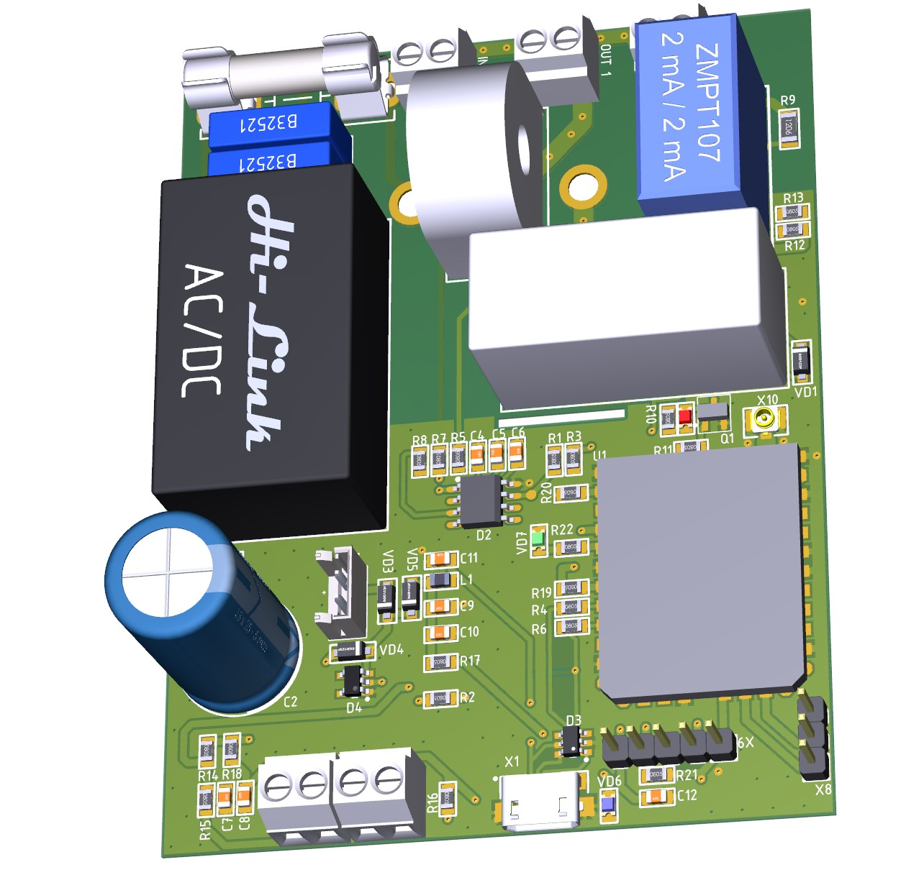
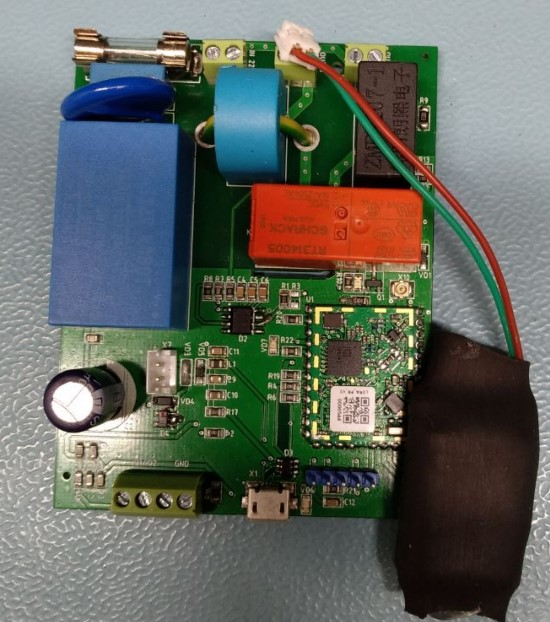

<h1 align = "center">🌟Smart Socket LORAWAN 🌟</h1>

## Schematic

- [Smart Socket SCH](./sh/smsc.pdf)

## Description

"Smart Socket" is a device that allows measuring voltage and current in a non-contact way using current transformers for galvanic isolation. It also comes equipped with a relay that allows turning on and off connected devices, and a battery that ensures the device's operation during power outages.
The project uses IMST 880B-L as the transmitting module. It is a radio module designed for long-range wireless communication using LORAWAN technology. It operates at frequencies of 868 MHz and 915 MHz and provides communication range up to 15 km in an open area and up to 3 km in urban areas.
The firmware for the "Smart Socket" project is developed based on the open-source LORAWAN stack. This ensures high reliability and stable operation of the device, as well as compatibility with other LORAWAN-based devices and applications.
The main areas of use for the device are:

1.	In household: The device can be used to control various electrical appliances such as lights, air conditioners, computers, etc. Additionally, it can be used to monitor electrical parameters such as voltage and current, allowing you to save energy and prevent electrical circuit overloads.
2.	In industry: The device can be used to monitor the power supply of industrial equipment such as machines, welding machines, compressors, etc. It can prevent possible electrical circuit overloads, improving equipment performance and durability.
3.	In medicine: The device can be used to monitor the electrical parameters of medical equipment, such as machines and monitors. This can help prevent possible equipment damage and increase its efficiency during medical procedures.
4.	In public places: The device can be used to monitor electrical loads in public places such as shopping centers, office buildings, etc. It can prevent electrical circuit overloads and increase the safety of electrical systems in these areas.

In this repository, you can find the source code for the "Smart Socket" project developed in Altium Designer 17.
